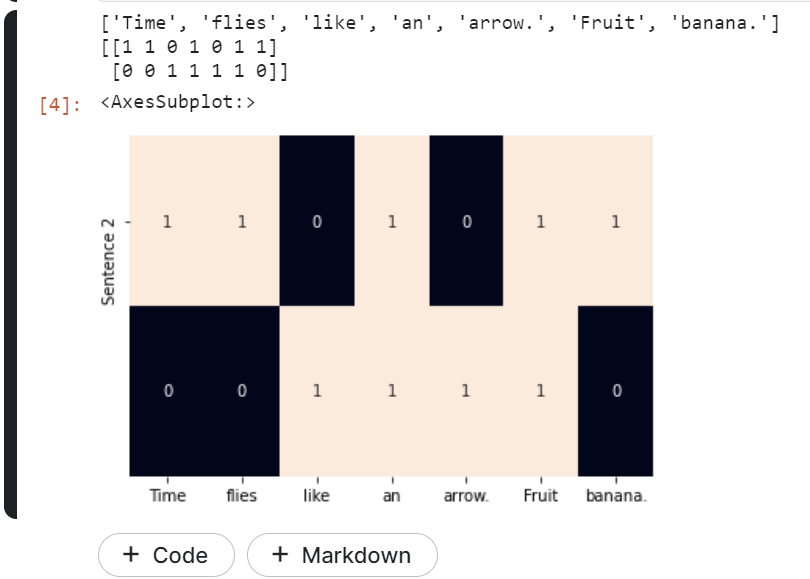
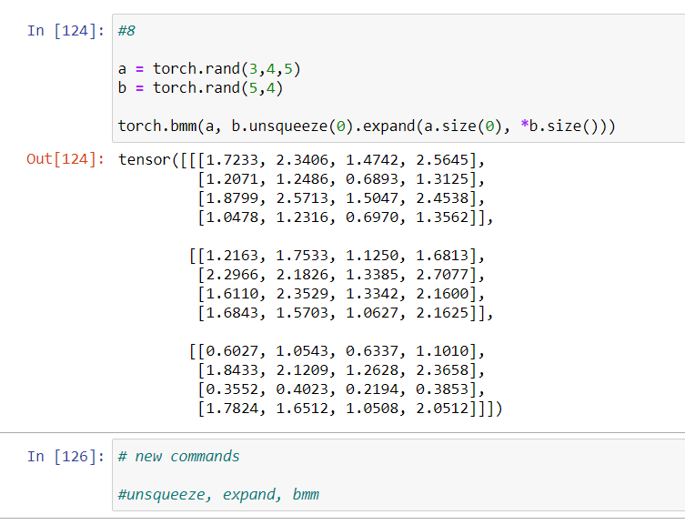

# Chapter 1 : Introduction

https://www.kaggle.com/fanbyprinciple/nlp-with-pytorch-chapter-1/edit

- Observations
- Targets
- Model
- Parameters
- Predictions
- Loss function

### Stochastic gradient descent

- gradient descent is a common technique to find the roots of an equation

- we guess some initial values for the roots and update parameters iteratively until the objective function (loss function ) evaluates to a value below an acceptable criterion (aka convergence criterion)

- For large datasets, implementation of traditional gradient descent over the entire dataset is ussually impossible due to memroy constraints, andvery slow due to computational expense.

- in stochastic gradeint descent (SGD) is usually employed, where a datapoint of a subset are picked at random and then gradient is computed for that subset. 

- Each step of backpropagation consists of a forward pass and a backward pass. forward pass for current inputs and computes the loss function, the backward pass updates the paramaeters using the gradient of the loss

- one hot encoded vector -  starts witha  zero vector and sets as 1 the corresponding entry in the vector if the word is present in the sentence or document.

- TF representation of a phrase, sentence or document is simple the sum of the one hot representations of its constituent words. 

- We denote the TF of a word w by TF(w)

- Term frequency representation:

### TF IDF Representation

- Term frequency might tell us about frequency of occurance but it doesnt tell us about how important occurance of a word is, it is looked after bu Tf-IDf representation

### Target encoding

- The target is also text and is encoded using approaches such as the previously described one-hot encoding

- Many NLP tasks actually use categorical labels. where a model must predict a simple set of labels

- language modelling problem, when set of output space is large as in case of predicting next set of words

- some nlp problems involve predicting a numerical value form a given text. binning can be uniform or non uniform and data-driven.

### Computational Graphs

- Way to represent dataflow. Its an abstarction that models mathematical graph.

- For example `y = wx + b` can be broken down into  , `z = x * w` , `y = z + b`

### Pytorch basics

- Pytorch is open source community driven framework. 

- it allows us to make computatuioal graphs dynamically. 

- This is extremely helpful in debgging.

### Dynamic versus static computational graphs

- Static frameworks like Theano, Caffe and tensorFlow require the computational graph, to be first declared compiled and then executed.

- Pytorch builds dynamically computed dynamic graph. 

- In pytorch to familiarize you with various Pytorch operations.

- Creating tensors

- Operations with tensors

- Indexing, slicing , and joining with tensors

- Computing gradients with tensors

- using CUDA tensors with GPU

### Installing pytorch

- First step is to install PyTorch on your machines by choosing your system preferences at pytorch.org

- Rank of tensors.

### Tensors and Computational graphs

- when
the `requires_grad` Boolean flag is set to True on a tensor, bookkeeping operations are enabled
that can track the gradient at the tensor as well as the gradient function, both of which are needed to
facilitate the gradient­based learning

- requires_grad functionality

- When we create a tensor with requires_grad = True we are requiring Pytorch to manage bookkeeping information that computes gradients. Then at the end of computations, a single scalar is used to compute a backward pass.

- The backward pass is initiated by using the backward() method on a tensor resulting from the
evaluation of a loss function. The backward pass computes a gradient value for a tensor object that
participated in the forward pass.

### Cuda tensors

- When operating on two tensor objects, make sure they’re both on the same device.

- Keep in mind that it is expensive to move data back and forth from the GPU. Therefore, the typical
procedure involves doing many of the parallelizable computations on the GPU and then transferring
just the final result back to the CPU. This will allow you to fully utilize the GPUs. If you have several
CUDA­visible devices (i.e., multiple GPUs), the best practice is to use the
CUDA_VISIBLE_DEVICES environment variable when executing the program

## Exercises

1. Create a 2D tensor and then add a dimension of size 1 inserted at dimension 0.
2. Remove the extra dimension you just added to the previous tensor.
3. Create a random tensor of shape 5x3 in the interval [3, 7)
4. Create a tensor with values from a normal distribution (mean=0, std=1).
5. Retrieve the indexes of all the nonzero elements in the tensor torch.Tensor([1, 1, 1,
0, 1]).6
. Create a random tensor of size (3,1) and then horizontally stack four copies together.
7. Return the batch matrix­matrix product of two three­dimensional matrices
(a=torch.rand(3,4,5), b=torch.rand(3,5,4)).
8. Return the batch matrix­matrix product of a 3D matrix and a 2D matrix
(a=torch.rand(3,4,5), b=torch.rand(5,4)).

