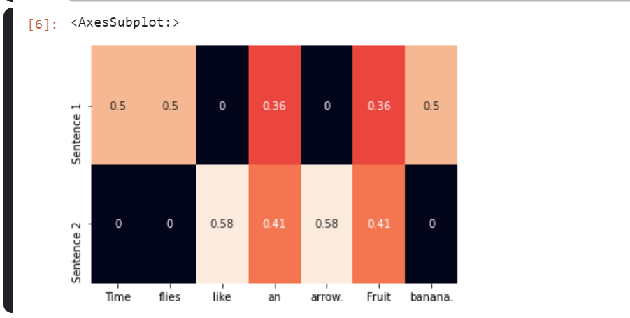

# Chapter 1 : Introduction

https://www.kaggle.com/fanbyprinciple/nlp-with-pytorch-chapter-1/edit

- Observations
- Targets
- Model
- Parameters
- Predictions
- Loss function

### Stochastic gradient descent

- gradient descent is a common technique to find the roots of an equation

- we guess some initial values for the roots and update parameters iteratively until the objective function (loss function ) evaluates to a value below an acceptable criterion (aka convergence criterion)

- For large datasets, implementation of traditional gradient descent over the entire dataset is ussually impossible due to memroy constraints, andvery slow due to computational expense.

- in stochastic gradeint descent (SGD) is usually employed, where a datapoint of a subset are picked at random and then gradient is computed for that subset. 

- Each step of backpropagation consists of a forward pass and a backward pass. forward pass for current inputs and computes the loss function, the backward pass updates the paramaeters using the gradient of the loss

- one hot encoded vector -  starts witha  zero vector and sets as 1 the corresponding entry in the vector if the word is present in the sentence or document.

- TF representation of a phrase, sentence or document is simple the sum of the one hot representations of its constituent words. 

- We denote the TF of a word w by TF(w)

- Term frequency representation:

### TF IDF Representation

- Term frequency might tell us about frequency of occurance but it doesnt tell us about how important occurance of a word is, it is looked after bu Tf-IDf representation

### Target encoding

- The target is also text and is encoded using approaches such as the previously described one-hot encoding

- Many NLP tasks actually use categorical labels. where a model must predict a simple set of labels

- language modelling problem, when set of output space is large as in case of predicting next set of words

- some nlp problems involve predicting a numerical value form a given text. binning can be uniform or non uniform and data-driven.

### Computational Graphs

- Way to represent dataflow. Its an abstarction that models mathematical graph.

- For example `y = wx + b` can be broken down into  , `z = x * w` , `y = z + b`

### Pytorch basics

- Pytorch is open source community driven framework. 

- it allows us to make computatuioal graphs dynamically. 

- This is extremely helpful in debgging.

### Dynamic versus static computational graphs

- Static frameworks like Theano, Caffe and tensorFlow require the computational graph, to be first declared compiled and then executed.

- Pytorch builds dynamically computed dynamic graph. 

- In pytorch to familiarize you with various Pytorch operations.

- Creating tensors

- Operations with tensors

- Indexing, slicing , and joining with tensors

- Computing gradients with tensors

- using CUDA tensors with GPU

### Installing pytorch

First step is to install PyTorch on your machines by choosing your system preferences at pytorch.org

Rank of tensors.

page 20, tesnors and compute graphs.

