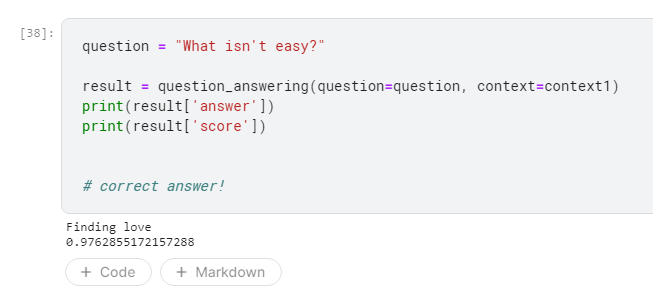
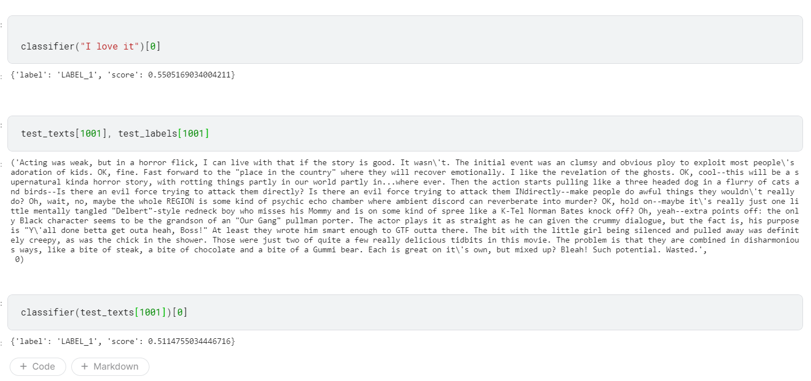

# Hugging face corner!

# Creating hugging face using custom dataset

https://www.kaggle.com/fanbyprinciple/hugging-face-custom-dataset-seq-classification/edit

# Fine tuning hugging face on a custom dataset

https://www.kaggle.com/fanbyprinciple/fine-tuning-with-hugging-face/edit

